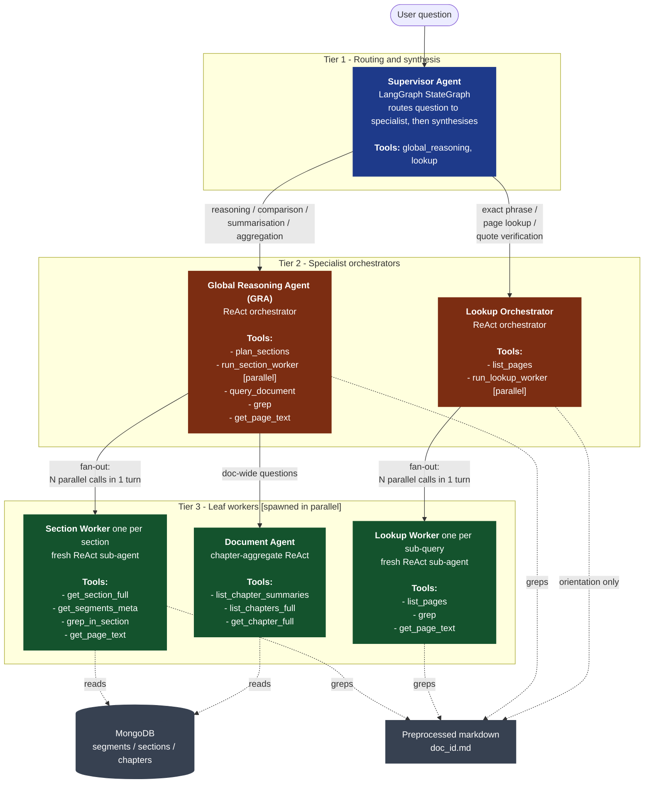

# Modus — Multi-Agent System for Long Document Intelligence (No RAG)

A multi-agent system that answers complex questions over a ~500+ page scanned document **without retrieval-based methods** (no vector DBs, no embeddings, no similarity search), under a strict **128K token context budget per agent**.

Instead of RAG, the system takes a **Claude-Code-style grep + ReAct** approach: cheap structured aggregates for orientation, literal grep over preprocessed markdown for grounding, and a deep hierarchy of agents that spawn parallel sub-agents to keep every individual context window small. Multi-hop reasoning emerges from the hierarchy itself — supervisor → orchestrator → parallel workers — rather than from semantic similarity.

> **Scope of this README.** The repo has two pipelines. This README focuses on the [qna-pipeline/](qna-pipeline/) — the multi-agent QnA system. The upstream [doc-processing-pipeline/](doc-processing-pipeline/) is summarised in [Upstream: Document Processing](#upstream-document-processing) for context.

---

## Table of contents

- [Requirements coverage](#requirements-coverage-mapped-from-the-technical-assignment)
- [Architecture at a glance](#architecture-at-a-glance)
- [Why no RAG — the Claude-Code-grep approach](#why-no-rag--the-claude-code-grep-approach)
- [Multi-agent hierarchy (mermaid diagram)](#multi-agent-hierarchy)
- [Agent roles and tools](#agent-roles-and-tools)
- [Parallel agent spawning](#parallel-agent-spawning--how-we-stay-under-128k)
- [Context management strategy](#context-management-strategy)
- [Upstream: Document Processing](#upstream-document-processing)
- [Running the pipeline](#running-the-pipeline)
- [Example queries (3 complex types)](#example-queries-3-complex-types)
- [Design tradeoffs](#design-tradeoffs)

---

## Requirements coverage (mapped from the Technical Assignment)

| Requirement (from the assignment PDF) | How this system satisfies it |
| --- | --- |
| **§3.1 Open-source models only** | Every agent talks to an LLM through a [LiteLLM proxy](qna-pipeline/utils/llm.py) — the system is model-agnostic and any open-source model (Llama, Qwen, Mistral, DeepSeek, etc.) can be slotted in via `MODEL_NAME` without code changes. |
| **§3.1 128K context window cap** | No single agent ever sees the full document. Raw page text is held only inside short-lived worker sub-agents; the supervisor and orchestrators see only short worker answers + bounded grep snippets. Every per-agent context window stays well below 128K regardless of document size. See [Context management strategy](#context-management-strategy). |
| **§3.1 ~500+ page input** | Tested on the ICICI Bank annual report (500+ pages). The architecture is doc-size-agnostic — adding pages adds more sections/chapters in MongoDB and more lines in the preprocessed markdown, but the agent context budgets are unchanged. |
| **§3.2 Multi-agent design with clearly defined responsibilities** | Three tiers, six distinct agent types, each with a single responsibility: supervisor (routing + synthesis), GRA (reasoning orchestration), Lookup orchestrator (exact-retrieval orchestration), section worker (one section), document agent (chapter aggregates), lookup worker (one focused grep task). See [Agent roles and tools](#agent-roles-and-tools). |
| **§3.2 No retrieval (no vector DB, no embeddings, no similarity search)** | Grounding is done with **literal regex/substring grep** over the preprocessed markdown plus **typed structured aggregates** in MongoDB. There are zero embeddings anywhere in the codebase. See [Why no RAG](#why-no-rag--the-claude-code-grep-approach). |
| **§3.3 Handle OCR noise** | OCR runs upstream in the [doc-processing-pipeline](doc-processing-pipeline/), which cleans and normalises the extracted text into a structured markdown with explicit page markers before the QnA pipeline sees it. |
| **§3.3 No single step exceeds 128K** | Enforced by construction: section workers see one section; the document agent sees only chapter aggregates (~10–20 records); `get_page_text` is hard-capped at 8K tokens per call; `grep` is capped at 20 matches × 200-char snippets per call; the supervisor and orchestrators never receive raw page text. |
| **§4.1 Document ingestion & logical units** | Upstream pipeline OCRs → cleans → segments → analyses → aggregates. Output: a preprocessed markdown (the grep substrate) and MongoDB collections of `segments`, `sections`, and `chapters` (the structured aggregates). See [Upstream: Document Processing](#upstream-document-processing). |
| **§4.2 Local understanding** | Section workers and lookup workers operate on a single section or a narrow page range. |
| **§4.2 Aggregation** | Done **once, upstream**: segments roll up into sections, sections roll up into chapters. The QnA pipeline reads these pre-built aggregates instead of re-aggregating per query. |
| **§4.2 Global reasoning** | The GRA combines parallel section workers and the document-level chapter agent to reason across the entire document scope. |
| **§4.3 Progressive context reduction** | Raw OCR text → cleaned markdown → segments → section aggregates → chapter aggregates → short worker answers → supervisor synthesis. Each hop reduces volume by ~5–10× while preserving the structured fields that matter (entities, claims, decisions, risks, contradictions, metrics, quotes). |
| **§4.4 Query types — full/section summarisation** | `query_document` (full) and `run_section_worker` (per-section), routed through the GRA. |
| **§4.4 Query types — cross-section comparison** | `plan_sections` produces N parallel `run_section_worker` calls; GRA synthesises the comparison. |
| **§4.4 Query types — entity / risk / decision extraction** | Already typed fields on every section and chapter aggregate (`key_entities`, `risks`, `decisions`, etc.) — answered by `query_document` against chapters, or by section workers per section. |
| **§4.4 Query types — inconsistencies / contradictions** | Chapter aggregates carry a typed `contradictions` field, plus `query_document` can compare claims across chapters. Lookup agent verifies the literal wording of conflicting quotes. |

---

## Architecture at a glance

```
        User question
              │
              ▼
   ┌───────────────────────┐
   │  Supervisor Agent     │  ── routing + final synthesis
   └──────────┬────────────┘
              │
       ┌──────┴──────────────────────────────┐
       ▼                                     ▼
┌──────────────────┐                ┌────────────────────┐
│ Global Reasoning │                │  Lookup Agent      │
│ Agent (GRA)      │                │  (Orchestrator)    │
│                  │                │                    │
│ reasoning,       │                │ exact retrieval:   │
│ comparison,      │                │ literal phrases,   │
│ summarisation,   │                │ page lookups,      │
│ aggregation      │                │ quote verification │
└────────┬─────────┘                └──────────┬─────────┘
         │ fan-out (parallel)                  │ fan-out (parallel)
         ▼                                     ▼
  Section Workers  +  Document Agent     Lookup Workers
  (one per section)   (chapter-level)    (one per sub-query)
```

Each level only ever sees short, bounded outputs from the level below. Raw page text lives exclusively inside the leaf workers, whose contexts are discarded after each call.

---

## Why no RAG — the Claude-Code-grep approach

The assignment forbids retrieval (vector DBs, embeddings, similarity search). That removes the standard "chunk + embed + nearest-neighbour" crutch. We replace it with the same primitive Claude Code uses to navigate large codebases: **literal `grep` over a flat text substrate, driven by an LLM that decides what to search for and where**.

**Two grounding substrates, no embeddings:**

1. **Preprocessed markdown** (`{doc_id}.md`) — the full document as a single flat file with explicit page markers (`{N}---`) and footer-derived printed-page mappings ([qna-pipeline/qna_pipeline/db/markdown.py](qna-pipeline/qna_pipeline/db/markdown.py)). Backs `grep` and `get_page_text`.
2. **Typed MongoDB aggregates** — `segments`, `sections`, `chapters` collections, each carrying structured fields (`summary`, `key_entities`, `key_claims`, `decisions`, `risks`, `contradictions`, `metrics`, `salient_quotes`, `topics`, `pages`). Backs `plan_sections`, `run_section_worker`, `query_document`.

**Multi-hop reasoning** falls out of how the agents are wired:

- A user asks *"Does the document contradict itself on capital adequacy guidance?"*
- Supervisor routes to GRA.
- GRA calls `plan_sections` → planner returns the 4 sections that mention capital adequacy.
- GRA spawns **4 section workers in parallel**; each greps its own section for the relevant claims, fetches a page if needed, and returns a 3-line summary with page citations.
- GRA synthesises the contradiction across the 4 worker answers.
- Supervisor optionally fires off the **Lookup Agent** to pin the exact wording of the two conflicting claims on the page.

The grep tool grounds every claim to a `printed_page` + `line` + `snippet`, so answers are verifiable without a similarity score.

---

## Multi-agent hierarchy



**How to read this diagram:**

- **Tier 1 (Supervisor)** sees only the user question and the short final answers from Tier 2.
- **Tier 2 (Orchestrators)** see only short worker answers and bounded grep snippets — never raw page text.
- **Tier 3 (Leaf workers)** are the only agents that ever load raw page text or full section aggregates into their context. They are short-lived and discarded after each call.
- Arrows marked **⚡parallel** show fan-out points. Each parallel branch runs in its own context window, in its own ReAct loop, with no memory of the parent conversation.

---

## Agent roles and tools

### Tier 1 — Supervisor agent

- **File:** [qna-pipeline/qna_pipeline/nodes/supervisor_agent.py](qna-pipeline/qna_pipeline/nodes/supervisor_agent.py)
- **Prompt:** [qna-pipeline/config/prompts/supervisor_prompt.py](qna-pipeline/config/prompts/supervisor_prompt.py)
- **Responsibility:** read the user's question, route it to the GRA (reasoning) or the Lookup Agent (exact retrieval), optionally chain the two, then synthesise the final answer. Implemented as a LangGraph `StateGraph` node with two tools.
- **Tools (sub-agents exposed as tools):**
  - `global_reasoning(question)` — calls the GRA.
  - `lookup(question)` — calls the Lookup orchestrator.
- **Routing tiebreaker:** when uncertain, prefer `lookup` first (faster, more grounded) and failover to `global_reasoning` on miss. Hybrid GRA→lookup or lookup→GRA chaining is expected.

### Tier 2a — Global Reasoning Agent (GRA)

- **File:** [qna-pipeline/qna_pipeline/tools/global_reasoning_tool.py](qna-pipeline/qna_pipeline/tools/global_reasoning_tool.py)
- **Prompt:** [qna-pipeline/config/prompts/global_reasoning_prompt.py](qna-pipeline/config/prompts/global_reasoning_prompt.py)
- **Responsibility:** Claude-Code-style ReAct orchestrator that picks the shortest path to a grounded reasoning answer. Owns the section-fan-out, the document-level agent, and direct grep.
- **Five tools:**
  - `plan_sections(query)` — single-LLM structured-output planner; returns up to `PLAN_MAX_TASKS` `(section_name, sub_query)` tasks.
  - `run_section_worker(section_name, sub_query)` — dispatch one section worker. Called **N times in parallel** in a single assistant turn.
  - `query_document(query)` — dispatch the chapter-aggregate document agent.
  - `grep(pattern, pages_filter=None, regex=False, limit=20)` — direct doc-wide grep.
  - `get_page_text(printed_pages)` — raw markdown for specific printed pages (8K-token capped).

### Tier 2b — Lookup orchestrator

- **File:** [qna-pipeline/qna_pipeline/tools/lookup_agent_tool.py](qna-pipeline/qna_pipeline/tools/lookup_agent_tool.py)
- **Prompt:** [qna-pipeline/config/prompts/lookup_orchestrator_prompt.py](qna-pipeline/config/prompts/lookup_orchestrator_prompt.py)
- **Responsibility:** specialist for exact retrieval — literal phrases, page-named questions, quote/line verification. Mirrors the GRA's fan-out pattern with a much smaller tool surface. **Deliberately has no direct `grep` / `get_page_text`** — heavy reading happens in worker context windows so the orchestrator stays small even on multi-target adversarial questions.
- **Two tools:**
  - `list_pages()` — cheap orientation (~30 tokens of output).
  - `run_lookup_worker(sub_query, pages_filter=None)` — dispatch one focused worker. Called **N times in parallel** in a single assistant turn.

### Tier 3a — Section worker

- **File:** [qna-pipeline/qna_pipeline/tools/section_worker_tool.py](qna-pipeline/qna_pipeline/tools/section_worker_tool.py)
- **Prompt:** [qna-pipeline/config/prompts/section_worker_prompt.py](qna-pipeline/config/prompts/section_worker_prompt.py)
- **Responsibility:** answer one self-contained sub-question against ONE section. Fresh ReAct sub-agent per call, discarded after answering.
- **Four tools (scoped to one `section_name`):**
  - `get_section_full()` — full `AggregateAnalysis` for the section.
  - `get_segments_meta()` — per-segment metadata when section aggregate is too coarse.
  - `grep_in_section(pattern, regex=False)` — grep restricted to the section's pages.
  - `get_page_text(printed_pages)` — raw markdown for specific pages (8K-token capped).

### Tier 3b — Document agent

- **File:** [qna-pipeline/qna_pipeline/tools/document_agent_tool.py](qna-pipeline/qna_pipeline/tools/document_agent_tool.py)
- **Prompt:** [qna-pipeline/config/prompts/document_agent_prompt.py](qna-pipeline/config/prompts/document_agent_prompt.py)
- **Responsibility:** doc-wide questions (full summary, list-every-X, cross-chapter consistency). Its ONLY data source is the chapters collection (~10–20 records for a 500-page doc).
- **Three tools:**
  - `list_chapter_summaries()` — cheap orientation.
  - `list_chapters_full()` — full aggregates for every chapter (expensive, ≤1 call per question).
  - `get_chapter_full(chapter_name)` — drill into one chapter.

### Tier 3c — Lookup worker

- **File:** [qna-pipeline/qna_pipeline/tools/lookup_worker_tool.py](qna-pipeline/qna_pipeline/tools/lookup_worker_tool.py)
- **Prompt:** [qna-pipeline/config/prompts/lookup_worker_prompt.py](qna-pipeline/config/prompts/lookup_worker_prompt.py)
- **Responsibility:** answer one focused exact-retrieval sub-question. Fresh ReAct sub-agent per call.
- **Three tools:**
  - `list_pages()` — sanity-check a printed page number.
  - `grep(pattern, pages_filter=None, regex=False, limit=20)` — doc-wide grep (defaults to the orchestrator's `pages_filter` hint when one was supplied).
  - `get_page_text(printed_pages)` — raw markdown for specific pages.

---

## Parallel agent spawning — how we stay under 128K

A single ReAct loop with a 500-page document attached to context would blow the 128K budget immediately. We never do that. Instead:

1. **Spawn fresh sub-agents per sub-question.** Every `run_section_worker` / `run_lookup_worker` / `query_document` call creates a brand-new `create_react_agent` with its own message history. The parent never inherits the child's tool-call traces.
2. **Fan out in a single assistant turn.** Both the GRA and the Lookup orchestrator are instructed to emit **N tool calls in one assistant turn**, which LangGraph's `ToolNode` executes in parallel. Caps: `WORKER_PARALLEL_CAP=8` for section workers, `LOOKUP_WORKER_PARALLEL_CAP=8` for lookup workers, `PLAN_MAX_TASKS=10` for the section planner.
3. **Discard worker context after answering.** The parent receives only the worker's final string — typically a few hundred tokens — never the worker's full ReAct trace.
4. **Closures, not InjectedState.** Inner tools close over `document_id` instead of relying on LangGraph's `InjectedState`, because the inner ReAct loop does not propagate the outer state. This keeps each worker's tool surface narrow and fully typed.

**Concrete worked example — comparing risk factors across 5 sections:**

| Step | Agent | Context size |
| --- | --- | --- |
| 1. Supervisor reads question | Supervisor | ~1K tokens (prompt + question) |
| 2. Supervisor → `global_reasoning(...)` | GRA | ~2K tokens (GRA prompt + question) |
| 3. GRA → `plan_sections(...)` | Planner (single LLM call) | ~10–30K tokens (section list as JSON) — **isolated, returns ~500 tokens** |
| 4. GRA → 5× `run_section_worker(...)` in parallel | 5 Section Workers | each ~5–15K tokens (one section aggregate + maybe one `get_page_text`) — **isolated per worker** |
| 5. GRA receives 5 short answers | GRA | ~4K tokens total |
| 6. GRA synthesises, returns to supervisor | Supervisor | ~5K tokens |
| 7. Supervisor writes final answer | Supervisor | ~6K tokens |

**No single agent ever sees more than ~30K tokens.** The 128K budget is a comfortable ceiling.

---

## Context management strategy

The system implements **progressive information reduction** at three different timescales:

**Build-time reduction (upstream, once per document):**

```
Raw OCR text          ── 500+ pages, ~1M+ tokens
   │
   ▼  preprocessing (clean, normalise, add page markers)
Preprocessed markdown ── grep substrate, still full text but flat
   │
   ▼  segmentation (split into logical segments)
Segments              ── ~100s of segments, stored in Mongo
   │
   ▼  segment_analyzer_agent (per-segment structured analysis)
Segment aggregates    ── typed fields: summary, entities, claims, ...
   │
   ▼  aggregation_agent (roll up to sections, then to chapters)
Sections + Chapters   ── ~30 sections, ~10-20 chapters in Mongo
```

The chapters collection on its own is small enough (~10–20 records of structured JSON) for the document agent to load all of it into a single 128K context window for doc-wide questions.

**Query-time reduction (per question):**

```
User question
   │
   ▼  supervisor (routes, never reads raw text)
Tool call to GRA or Lookup
   │
   ▼  orchestrator (plans, fans out, never reads raw text in bulk)
N parallel sub-queries
   │
   ▼  workers (each reads ONE section / one page range)
N short worker answers (each ~100–500 tokens)
   │
   ▼  orchestrator synthesises
One reasoned answer
   │
   ▼  supervisor synthesises
Final answer to user
```

**Tool-level reduction (per call):**

- `grep` is hard-capped at 20 matches × 200-char snippets per call.
- `get_page_text` is hard-capped at 8K tokens per call (tiktoken-counted).
- `plan_sections` is capped at 10 tasks (`PLAN_MAX_TASKS`).
- Parallel fan-out is capped at 8 workers (`WORKER_PARALLEL_CAP`, `LOOKUP_WORKER_PARALLEL_CAP`).

---

## Upstream: Document Processing

The QnA pipeline assumes two artifacts already exist for a given `document_id`:

1. A preprocessed markdown file at `output/preprocessed-output/{document_id}.md` with `{N}---` page markers and footer-derived printed-page numbers.
2. MongoDB collections `segments`, `sections`, `chapters` populated with typed `AggregateAnalysis` records (summary, key_entities, key_claims, decisions, risks, contradictions, metrics, salient_quotes, topics, pages).

These are produced by the [doc-processing-pipeline/](doc-processing-pipeline/), a separate LangGraph pipeline with five nodes:

| Node | File | Purpose |
| --- | --- | --- |
| Extraction | [extraction.py](doc-processing-pipeline/processing_pipeline/nodes/extraction.py) | OCR the input PDF |
| Preprocessing | [preprocessing.py](doc-processing-pipeline/processing_pipeline/nodes/preprocessing.py) | Clean, normalise, insert page markers, recover printed-page footers |
| Segmentation | [segmentation.py](doc-processing-pipeline/processing_pipeline/nodes/segmentation.py) | Split into logical segments |
| Segment Analyzer Agent | [segment_analyzer_agent.py](doc-processing-pipeline/processing_pipeline/nodes/segment_analyzer_agent.py) | Per-segment structured analysis |
| Aggregation Agent | [aggregation_agent.py](doc-processing-pipeline/processing_pipeline/nodes/aggregation_agent.py) | Roll segments up into sections and chapters |

OCR noise is handled here, not in the QnA pipeline — by the time a question is asked, the markdown is clean and the aggregates are typed.

---

## Running the pipeline

```bash
# 0. (One-time) From the repo root, set up the shared environment and
#    install all dependencies for both pipelines.
cp .env.example .env  # fill in MODEL_NAME, LITELLM_PROXY_URL, MONGODB_URI, ...
pip install -r requirements.txt

# 1. (One-time per document) Run the doc-processing pipeline to populate
#    the preprocessed markdown + MongoDB aggregates.
cd doc-processing-pipeline
langgraph dev

# 2. Run the QnA pipeline against the prepared document.
cd ../qna-pipeline
langgraph dev

# 3. (Optional) Start the Chainlit UI to chat with the QnA pipeline
#    in a browser instead of the LangGraph dev studio.
chainlit run chainlit_app/app.py -w
```

Both pipelines load the same root-level `.env` and share the same
`requirements.txt` at the repo root — there are no per-pipeline env files
or dependency files anymore.

**Chainlit UI** opens on `http://localhost:8000` by default. The app reads
`CHAINLIT_AUTH_SECRET` from the root-level `.env` for cookie signing — make
sure it is set (any long random string works; generate one with
`chainlit create-secret` if you need a fresh value). Conversation history
is persisted to `qna-pipeline/chainlit_data/` (SQLite) via the local data
layer, so chats survive restarts.

**Invocation shape:**

```json
{
  "run_id": "test-1",
  "question": "<the user's question>",
  "document_id": "<the doc_id used in upstream processing>"
}
```

**Key settings** (full list in [qna-pipeline/config/settings.py](qna-pipeline/config/settings.py)):

| Setting | Default | Purpose |
| --- | --- | --- |
| `MODEL_NAME` | (env) | The open-source model name routed through the LiteLLM proxy |
| `LITELLM_PROXY_URL` | (env) | The LiteLLM proxy endpoint |
| `GREP_MATCH_LIMIT` | 20 | Max matches returned per grep call |
| `GREP_SNIPPET_CHARS` | 200 | Characters of context around each grep match |
| `GET_PAGE_TEXT_TOKEN_CAP` | 8000 | Token cap for a single `get_page_text` call |
| `PLAN_MAX_TASKS` | 10 | Max sections the planner can request |
| `WORKER_PARALLEL_CAP` | 8 | Max parallel section workers per GRA turn |
| `LOOKUP_WORKER_PARALLEL_CAP` | 8 | Max parallel lookup workers per orchestrator turn |
| `SUPERVISOR_PROMPT_VERSION` | v1 | `v1` or `v2` (refined routing, failover, few-shots) |

---

## Example queries (3 complex types)

> **Status: placeholders.** Sample queries and expected routing are sketched below. Real run traces and outputs to be filled in after a fresh end-to-end run.

### 1. Cross-section comparison
**Query:** _TODO — e.g. "Compare the risk factors discussed in the credit-risk section vs the operational-risk section. Where do they agree, where do they diverge?"_

**Expected routing:** Supervisor → GRA → `plan_sections` → 2 parallel `run_section_worker` calls → GRA synthesises the comparison.

**Run trace:** _TODO — paste output from a real run_

### 2. Doc-wide entity / risk extraction
**Query:** _TODO — e.g. "List every distinct risk the document discloses, grouped by category, with the page where each is first introduced."_

**Expected routing:** Supervisor → GRA → `query_document` (chapter aggregates) → optional `grep` to confirm pages → synthesis.

**Run trace:** _TODO — paste output from a real run_

### 3. Inconsistency / contradiction identification (with verbatim citation)
**Query:** _TODO — e.g. "Does the document contradict itself anywhere on capital-adequacy guidance? If yes, quote both passages with page numbers."_

**Expected routing:** Supervisor → GRA → `query_document` (chapter `contradictions` field) or fan-out → Supervisor → `lookup` → parallel `run_lookup_worker` to fetch the two verbatim quotes → synthesis.

**Run trace:** _TODO — paste output from a real run_

---

## Design tradeoffs

**Why pre-aggregate in MongoDB instead of on-the-fly?**
The 128K budget is at query time. Re-aggregating segments-to-chapters every question would either blow the budget or require a giant orchestrator. By doing the heavy aggregation once upstream, the query-time path becomes "load a small typed record, optionally grep, answer" — fast and cheap.

**Why two orchestrators (GRA + Lookup) instead of one?**
Reasoning and exact-retrieval have different cost shapes. The Lookup orchestrator deliberately has no `grep` / `get_page_text` — heavy reading lives in workers — so it stays small even on adversarial multi-target questions. Folding everything into the GRA would either bloat the GRA's tool surface or force it to serialise lookup work.

**Why grep instead of vector search?**
The assignment forbids retrieval, but more importantly: with a clean preprocessed markdown and an LLM that can pick its own search patterns (literal phrase, regex, page filter), grep gives **verifiable, line-grounded answers** that don't depend on an embedding model's notion of similarity. This is the same trick that lets Claude Code navigate million-line codebases without an index.

**Why expose sub-agents as tools instead of using LangGraph subgraphs?**
Tools are the cleanest way to expose a "fire-and-forget self-contained agent" abstraction to a parent. The parent never sees the child's intermediate state; it only sees the final string. This makes the parallel fan-out (multiple `run_section_worker` calls in one assistant turn) trivial.

**Why closures over `document_id` instead of `InjectedState`?**
LangGraph's `InjectedState` does not propagate through nested ReAct loops created by `create_react_agent`. Closures over the document id make every tool fully self-contained and removes the need for the inner loop to know about the outer pipeline state.

**What we accepted as cost:**
- A first-time question on a new document pays the OCR + aggregation cost upstream. The QnA pipeline assumes that's already done.
- Adversarial wording differences (typos, OCR artefacts) can defeat a literal grep. The orchestrator prompts explicitly require trying synonyms, abbreviations, regex variants, and case variants before giving up.
- Latency scales with the number of parallel workers. A 5-section comparison is bounded by the slowest worker, not the sum — but a single worker can still take 10–20s on a long section.
